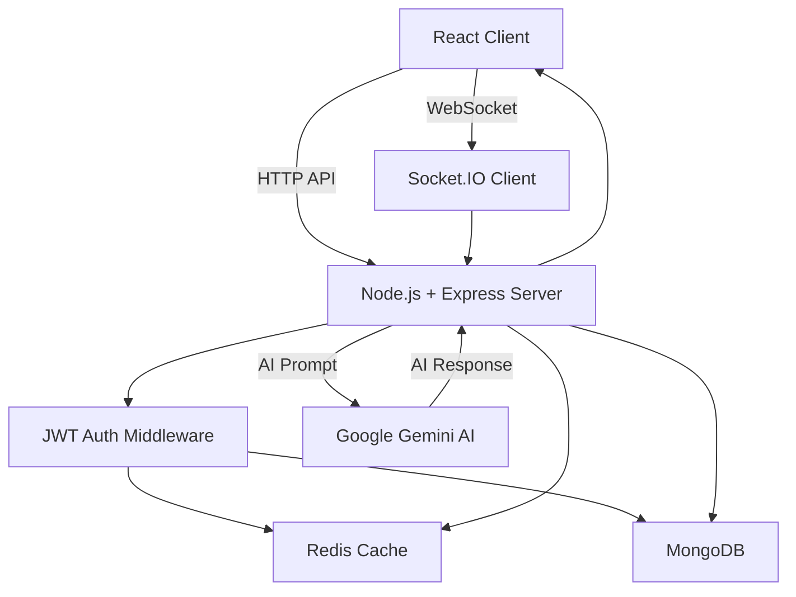

# 🚀 Real-Time Chat Application with AI

A **production-ready real-time chat application** built using the **MERN stack**, **Socket.IO**, **Redis**, and **Google Gemini AI**.
The application supports **real-time messaging**, **JWT-based authentication**, **Redis caching**, and **AI-powered responses**.
When the AI prompt is related to coding, it intelligently returns **proper file and folder structured output**.

---

## 🧠 Project Overview

This project demonstrates how to build a **scalable real-time system** using modern backend technologies. It combines:

* WebSockets for instant communication
* Redis for performance and caching
* MongoDB for persistent storage
* AI integration for intelligent responses

The system is designed keeping **system design and interview standards** in mind.

---

## 🏗️ Tech Stack

### Frontend

* React.js
* Tailwind CSS
* Socket.IO Client

### Backend

* Node.js
* Express.js
* Socket.IO
* JWT Authentication
* Google Gemini AI SDK

### Database & Caching

* MongoDB (persistent storage)
* Redis Cloud (caching & real-time optimization)

---

## ✨ Features

### 💬 Real-Time Chat

* Instant messaging using Socket.IO
* Event-driven WebSocket communication
* Secure socket connection with JWT

### 🧠 AI-Powered Responses

* AI replies powered by **Google Gemini**
* Detects code-related prompts
* Returns responses in **file & folder structure** format

### ⚡ Redis Integration

* Cache authenticated users
* Reduce MongoDB read operations
* Faster socket authentication and message flow

### 🔐 Authentication & Security

* JWT-based authentication for REST APIs
* JWT verification during Socket.IO handshake
* Redis-based session reuse

---

## 📂 Folder Structure

```
root
│
├── src
│   ├── app.js
│   ├── index.js
│   │
│   ├── db
│   │   └── connectDB.js
│   │
│   ├── models
│   │   ├── user.model.js
│   │   └── message.model.js
│   │
│   ├── controllers
│   │   └── chat.controller.js
│   │
│   ├── routes
│   │   └── auth.routes.js
│   │
│   ├── services
│   │   ├── redis.service.js
│   │   └── ai.service.js
│   │
│   ├── middlewares
│   │   └── socketAuth.middleware.js
│   │
│   └── sockets
│       └── socket.handler.js
│
├── .env
├── package.json
└── README.md
```

---

## ⚙️ Environment Variables

Create a `.env` file in the root directory:

```env
PORT=5000
MONGO_URI=your_mongodb_connection_string
JWT_SECRET=your_jwt_secret

REDIS_HOST=your_redis_host
REDIS_PORT=your_redis_port
REDIS_PASSWORD=your_redis_password

GEMINI_API_KEY=your_gemini_api_key
```

---

## ▶️ How to Run the Project

### Backend Setup

```bash
npm install
npm run dev
```

### Frontend Setup

```bash
cd client
npm install
npm start
```

---

## 🧠 System Design Diagram



---

## 🔄 Redis Workflow

1. Client connects via Socket.IO
2. JWT is verified during socket handshake
3. User session is cached in Redis
4. MongoDB queried only on cache miss
5. Improved performance and scalability

---

## 🤖 AI Response Flow

1. User sends a message
2. Server forwards prompt to Gemini AI
3. Gemini generates response
4. If prompt is code-related:

   * Response is structured into folders & files
5. Final response sent to client

---

## 🧪 Example AI Code Output

```
/src
 ├── controllers
 │    └── user.controller.js
 ├── routes
 │    └── user.routes.js
 └── app.js
```

---

## 🧠 Interview-Ready Explanation

> This project uses Socket.IO for real-time communication, Redis for caching authenticated sessions, MongoDB for persistence, and Google Gemini AI for intelligent responses. JWT authentication is applied to both HTTP and WebSocket connections, making the system secure, scalable, and production-ready.

---

## 🚀 Future Enhancements

* Redis Pub/Sub for horizontal scaling
* Typing indicators and read receipts
* Rate limiting using Redis
* Docker & Nginx deployment
* Message persistence optimization

---

## 👨‍💻 Author

**Vihar Chudasama**
Computer Science Student | MERN | Redis | System Design | AI Integration

---

⭐ If you like this project, give it a **star** on GitHub!
